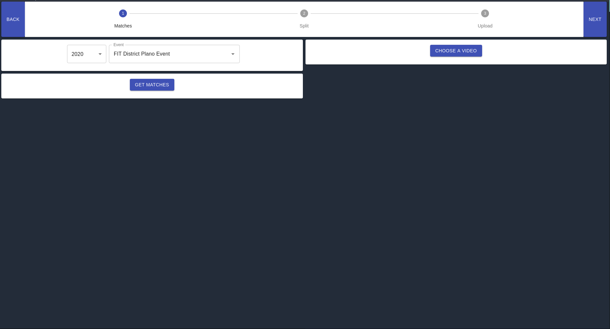
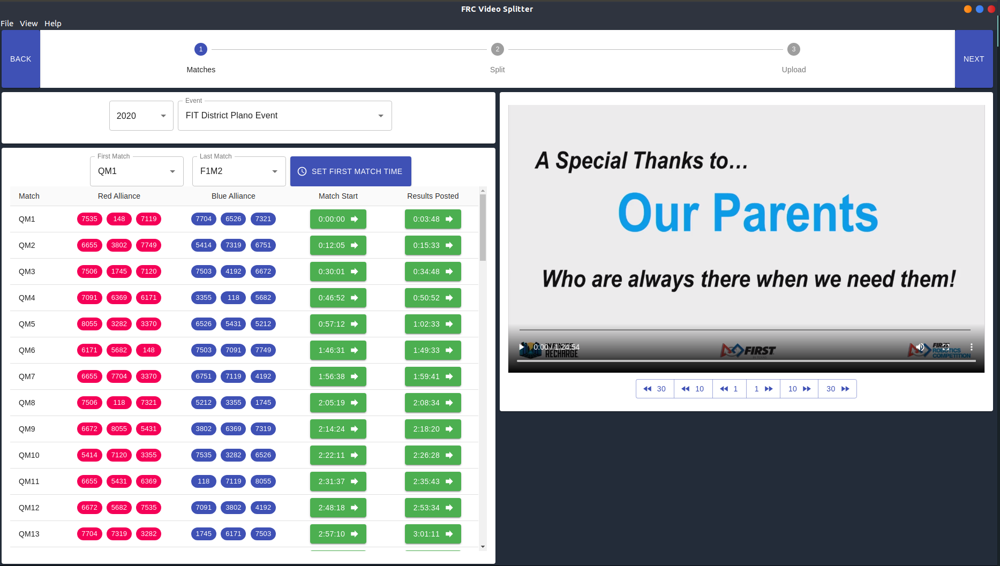
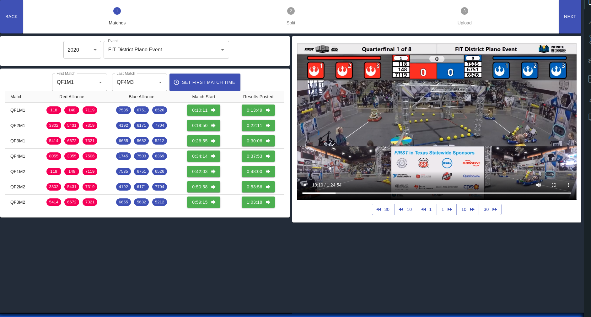
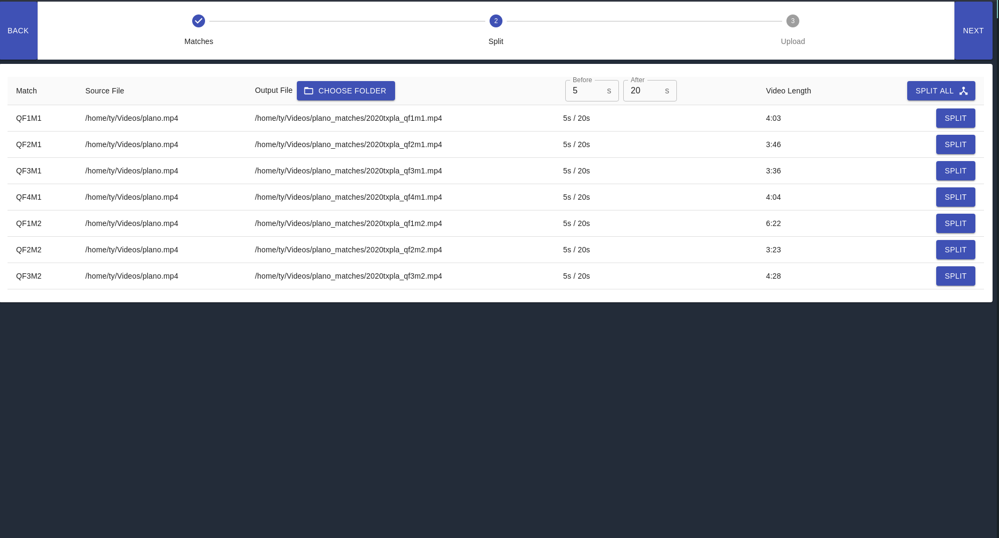

## Installation:

Choose the installer for your OS [here](https://github.com/tytremblay/frc-video-splitter-3/releases/tag/v0.0.10).

## How To Use:

### Configure Matches

1. Choose a Year
2. Choose an event from the dropdown (autocomplete works)



3. Click `Get Matches`
4. Choose a video
5. Scrub through the video until the first match in the video starts
   1. We recommend when the MC says "Drivers, behind the lines!" (or that year's equivalent).



6. Click the `Set First Match Time` botton
7. Select the key of the first match in the video in the `First Match` input.
8. Select the key of the last match in the video in the `Last Match` input.
   1. You can use the green buttons to seek the match video to that time stamp. Useful for verifying your match selections.



8. Click `Next`

### Split Matches



1. Click `Choose Folder` to choose an output folder for the match videos.
2. Adjust the extra padding time if desired.
3. Click `Split All` to split all matches, or split matches individually.

### Upload

[Coming soon]

## Starting Development

Start the app in the `dev` environment. This starts the renderer process in [**hot-module-replacement**](https://webpack.js.org/guides/hmr-react/) mode and starts a webpack dev server that sends hot updates to the renderer process:

```bash
yarn dev
```

## Packaging for Production

To package apps for the local platform:

```bash
yarn package
```
